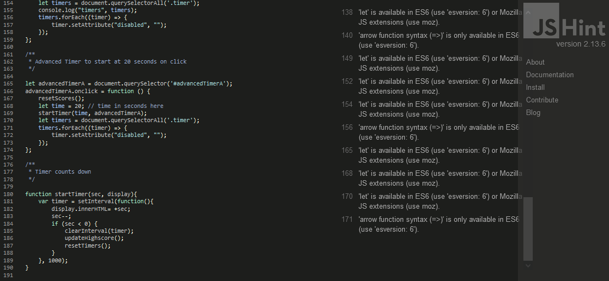
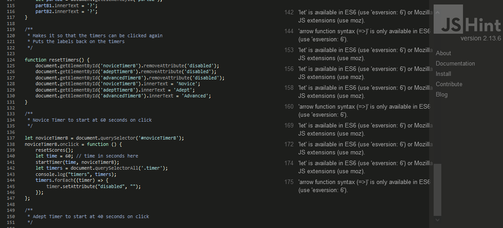
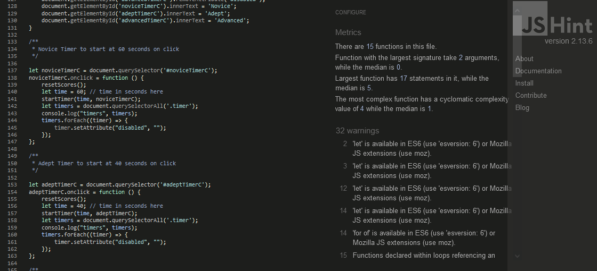
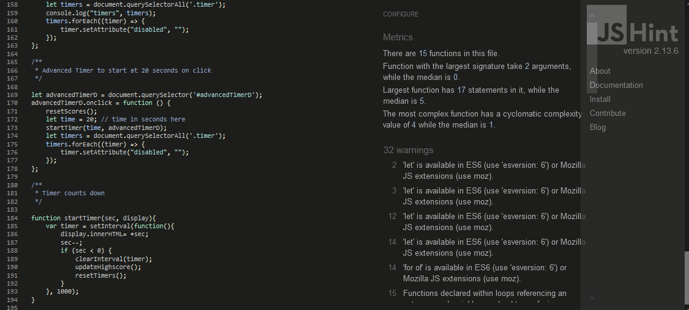
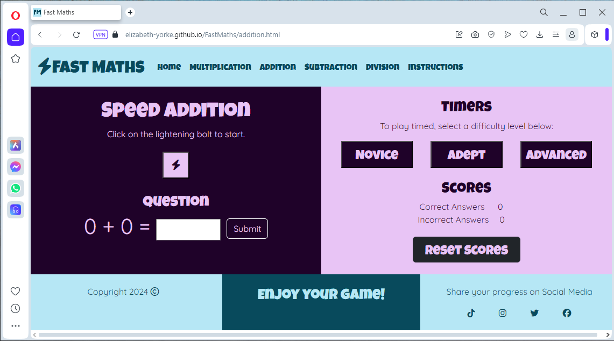
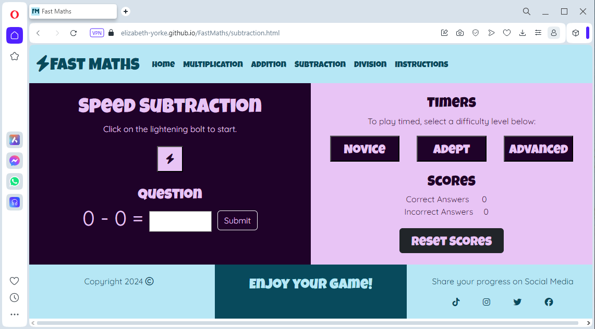

# Testing

Return back to the [README.md] (README.md) file.

## Validating Code

### HTML

The following validation has been done using the recommended [HTML W3C Validator](https://validator.w3.org) using the live, deployed site using the site links shown below.

| Page | W3C URL | Screenshot | Notes |
| --- | --- | --- | --- |
| Home | [W3C] (https://validator.w3.org/nu/?doc=https%3A%2F%2Felizabeth-yorke.github.io%2FFastMaths%2Findex.html)|  | No errors.|
| Multiplication| [W3C] (https://validator.w3.org/nu/?doc=https%3A%2F%2Felizabeth-yorke.github.io%2FFastMaths%2Fmultiplication.html)|  | No errors.|
| Addition | [W3C] (https://validator.w3.org/nu/?doc=https%3A%2F%2Felizabeth-yorke.github.io%2FFastMaths%2Faddition.html)|  | No errors.|
| Subtraction | [W3C] (https://validator.w3.org/nu/?doc=https%3A%2F%2Felizabeth-yorke.github.io%2FFastMaths%2Fsubtraction.html)|  | No errors.|
| Division | [W3C] (https://validator.w3.org/nu/?doc=https%3A%2F%2Felizabeth-yorke.github.io%2FFastMaths%2Fdivision.html)|  | No errors.|
| Instructions | [W3C] (https://validator.w3.org/nu/?doc=https%3A%2F%2Felizabeth-yorke.github.io%2FFastMaths%2Finstructions.html)|  | No errors.|
| 404 | [W3C] (https://validator.w3.org/nu/?doc=https%3A%2F%2Felizabeth-yorke.github.io%2FFastMaths%2F404.html)|  | No errors.|

### CSS

The following validation has been done using the recommended [The W3C CSS Validaton Service](https://jigsaw.w3.org/css-validator/validator) using the live, deployed site using the site links shown below.

| Page | W3C URL | Screenshot | Notes |
| style.css| [W3C] ([weblink](https://jigsaw.w3.org/css-validator/validator)) |  | No errors: Initial errors found and fixed.|

### JavaScript

The following validation has been done using [jshint.com](https://jshint.com/) using the live, deployed site using the site links shown below.

| Page | W3C URL | Screenshot | Notes |
| multiplication.js| [W3C] ([weblink](https://jshint.com/)) |  | 28 warnings explaining that various forms of javaScript are only available in particular JS extensions, 1 warning that functions declared within loops referencing an outer scoped variable may lead to confusing semantics.|
| addition.js| [W3C] ([weblink](https://jshint.com/)) |  | 28 warnings explaining that various forms of javaScript are only available in particular JS extensions, 1 warning that functions declared within loops referencing an outer scoped variable may lead to confusing semantics.|
| subtraction.js| [W3C] ([weblink](https://jshint.com/)) |  | 28 warnings explaining that various forms of javaScript are only available in particular JS extensions, 1 warning that functions declared within loops referencing an outer scoped variable may lead to confusing semantics.|
| division.js| [W3C] ([weblink](https://jshint.com/)) |  | 28 warnings explaining that various forms of javaScript are only available in particular JS extensions, 1 warning that functions declared within loops referencing an outer scoped variable may lead to confusing semantics.|

As all forms of javaScript refered to in these warnings were recommended within the course, I have decided to ignore the warnings for now.

## Testing Browser Compatibility

I've tested my deployed project on multiple browsers to check for compatibility issues.

| Browser | Screenshot | Notes |
| --- | --- | --- |
| Chrome |       | Works as expected, except that the pop up box needs to be closed several times.|
| Firefox |         | Works as expected |
| Edge |  [i](assets/documents/browser-testing/edge/) [i](assets/documents/browser-testing/edge/) [i](assets/documents/browser-testing/edge/) [i](assets/documents/browser-testing/edge/) [i](assets/documents/browser-testing/edge/)| Minor scaling issues |
| Opera |       | Works as expected|
| Avast |       | Works as expected, except that the pop up box has to be clicked twice before it disappears.|

## Testing Different Screen Sizes

I used media genesis responsive design checker [Media Genesis responsive design checker] (https://www.responsivedesignchecker.com/checker.php?url=https%3A%2F%2Felizabeth-yorke.github.io%2FFastMaths%2Findex.html&width=1400&height=700) to check how responsive this website is. I used the live, deployed site. Links below.

|Device|Screensize|URL|Screenshot|Notes|
| --- | --- | --- | --- | --- |
|Desktop 24"|Screensize 1920x1200|[screenshot]() |Works as expected|
|Desktop 20"|Screensize 1600x900|[screenshot](file pathway) |Works as expected|
|Notebook 13"|Screensize 1024x800|[screenshot](file pathway) |Works as expected|
|Tablet Apple iPad Pro|Screensize 1366x1024|[screenshot](file pathway) |Works as expected|
|Tablet Amazon Fire|Screensize 768x1024|[screenshot](file pathway) |Works as expected|
|Tablet Nexus 7|Screensize 600x960|[screenshot](file pathway) |Works as expected|
|Phone Apple iPhone 7 Plus|Screensize 414x736|[screenshot](file pathway) |Works as expected|
|Phone Google Pixel|Screensize 411x731|[screenshot](file pathway) |Works as expected|
|Phone Sony Xperia Z3|Screensize 360x640|[screenshot](file pathway) |Works as expected|

## Testing Website Speed

I tested my deployed project using using PageSpeed Insights via web.dev [PageSpeed](https://pagespeed.web.dev/analysis/https-elizabeth-yorke-github-io-SusieJunes-A/kv7di1miqk?form_factor=mobile)

|Page|Screensize|PageSpeed URL|Screenshot|Notes|
| --- | --- | --- | --- | --- |
|Home|Mobile|[PageSpeed URL](weblink)|[screenshot](file pathway)|Performs as expected.|
|Home|Desktop|[PageSpeed URL](weblink)|[screenshot](file pathway)|Performs as expected.|
|Instructions|Mobile|[PageSpeed URL](weblink)|[screenshot](file pathway)|Performs as expected.|
|Instructions|Desktop|[PageSpeed URL](weblink)|[screenshot](file pathway)|Performs as expected.|

## Fullfilling User Story Requirements

| User |User Story|Answer|Screenshot|
| --- | --- | --- | --- |
| New site user | I would like a game with simple instructions that are easy to follow. |Details.| [screenshot](filepath)|
| New site user | I would like a game that is quick to play. |Details.| [screenshot](filepath)|
| New site user | I would like instant feedback so I know if I'm getting things right or wrong. |Details.| [screenshot](filepath)|
| Returning site user | I would like a game that feels like I'm using my brain a bit, but isn't too hard. |Details.| [screenshot](filepath)|
| Returning site user | I would like a game in which I can see myself improving as I play more. |Details.| [screenshot](filepath)|
| Returning site user | I would like there to be new questions every time I play. |Details.| [screenshot](filepath)|
| Site Owner | I would like people to want to use this game. |Details.| [screenshot](filepath)|
| Site Owner | I would like people to leave good reviews about this game. |Details.| [screenshot](filepath)|
| Site Owner | I would like this game to respond smoothly. |Details.| [screenshot](filepath)|

## Debugging

I encountered a few bugs, particularly in during the testing phase. Here is what I did with each of them:

| Bug | Solution |
| --- | --- |
| Bug | Solution |

## Unfixed Bugs

| Bug | Comments |
| --- | --- |
| Bug | Comments |